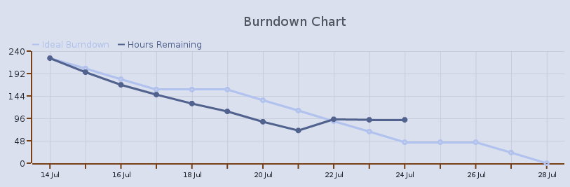
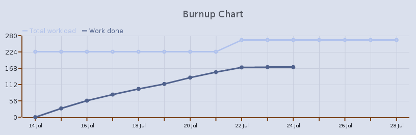
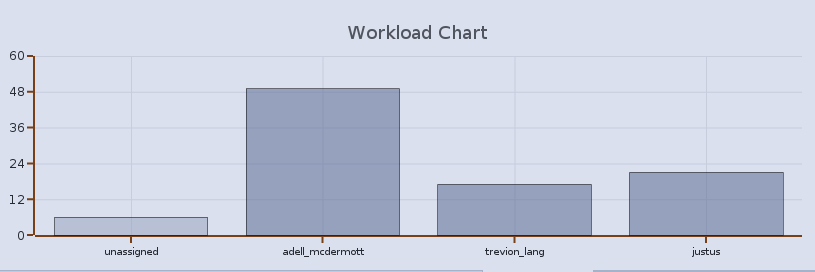

########################
Specification for charts
########################

There are some basic assumptions that we make when it comes to charts

* Charts are based *only* on the changes in hourly estimates within tasks on a sprint, not on estimates of backlog items.
* Data points are calculated at the end of each day, which leads to the "issue of the first day". We are aware of this, but currently we don't intend to change this for the sake of simplicity and usability.
* Events that occur during a sprint cannot change the past, data points representing days that have already passed shouldn't be modified.
* We don't store denormalized data points in the database, we always recalculate the chart data based on task logs (caching when possible).

Burn-down
=========

The burn-down chart consists of two lines

* Ideal burn-down (``I``) representing ideal progress of the sprint, when equal amount of work is being done each day and the chart hits zero by the end of the last day of the sprint. Recently we started to take free days into account, during the free day the ideal burn-down is flat.
* Hours remaining (``R``) representing actual progress of the sprint. It will mostly fall but it can also rise when the amount of work increases due to new tasks, additional items added to the sprint or increased estimates.

Let's consider a particular day of a sprint and call it ``i``. For each task consider the last estimate during the ``i``-th day and call it ``e_i``. Let's call ``d_i`` a number of working (non-free) days in the range between the ``i``-th and the last day (inclusive). We can calculate data points ``I_i`` and ``R_i`` using the following formula

* ``I_i := (sum_tasks(e_1) / d_1) * d_i``
* ``R_i := sum_tasks(e_i)``

Where ``sum_tasks(e_i)`` is the sum of daily estimates over all tasks. According to the formula above both lines begin at the same point which is represented by 

* ``I_1 := R_1 := sum_tasks(e_1)``

Both lines should meet at zero by the end of the sprint if the sprint is successful (all tasks completed or removed).

Burn-up
=======

The burn-up chart consists of two lines

* Total workload (``T``) representing scope of the sprint or how much work there is on a sprint as a whole. It can raise when there is a scope creep during the sprint or the initial estimates were too low. It can fall when we drop items or remove tasks from the sprint.
* Work done (``D``) representing work that has been already done during the current sprint. It starts at the origin and can only raise or be flat, in can never fall.

To calculate the data necessary to draw the chart we have to treat each day of the sprint individually. Let's call the given day ``i`` and for each task consider a list of estimate changes within that day ordered by time. Let's call the first estimate on this list ``a_i`` and the last estimate ``b_i``. Please note that ``a_i is NULL`` if the task has been created or added to the sprint and ``b_i is NULL`` if the task has been removed or dropped from the sprint during the given day.

Basing on this we can assign each task into one of the following three sets

* Removed tasks: if ``b_i is NULL``
* Rising tasks: if ``(a_i is NULL or b_i > a_i) and b_i is not NULL``
* Falling tasks: if ``b_i < a_i and b_i is not NULL``

For each task we can calculate a task delta using the formula ``d_i = b_i - a_i``, in this case we treat ``NULL`` as ``0``. Now we can calculate data points ``T_i`` and ``D_i`` using the following formula

* ``T_0 := D_0 := 0``
* ``T_i := T_{i-1} + sum_rising(d_i) + sum_removed(d_i)``
* ``D_i := D_{i-1} + sum_falling(d_i)``

Where ``sum_rising(d_i)`` is a sum of deltas over all rising tasks (always positive), ``sum_removed(d_i)`` is a sum of deltas over all removed tasks (always negative or zero) and ``sum_falling(d_i)`` is a sum of deltas for falling tasks (always negative).

All work is done if and only if the lines ``T`` and ``D`` meet in a single point. It can happen at the last day of a sprint or even earlier. In a successful sprint (all tasks completed or removed) the lines meet at the last day, in other words ``T_n = D_n`` where ``n`` is the last day of the sprint. For a formal proof ask Adam.

.. seealso::

    * `Interesting blog post <http://niksilver.com/2008/01/19/burn-up-and-burn-down-charts/>`_ about the difference between burn-up and burn-down charts

Workload
========

This is a bar chart showing the total numbers of hours on the sprint for each team member. It can be useful especially during planning to decide whether to commit to more tasks or not. It can be also used by the team during the course of the sprint to change the assignment of tasks when one person is overloaded.

There is one bar for each team member assigned to the sprint. The height of the bar represents sum of hours for tasks assigned to a given user on the sprint. It can be zero if all tasks are done. There is a special bar "unassigned" visible only when there is at least one unassigned task, it represent sum of hours for all unassigned tasks.
